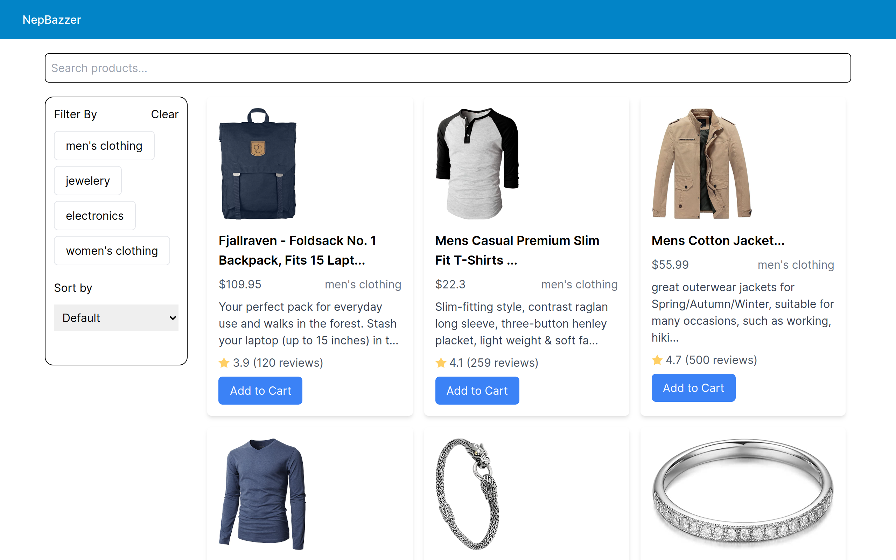
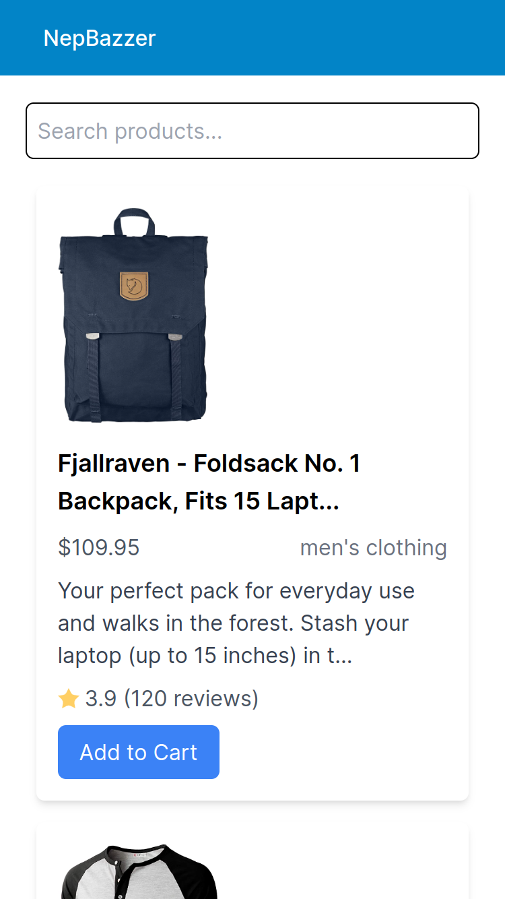

# NepBazzar E-commerce Website

This project aims to build an interactive product listing page for an e-commerce website. The page will dynamically fetch product information using an API and display it for users.

## Table of contents
- [Recommended Setup](#recommended-setup)
- [Overview](#overview)
  - [The challenge](#the-challenge)
  - [Screenshot](#screenshot)
  - [Links](#links)
  - [Built with](#built-with)
- [Author](#author)

## Recommended Setup

- Start Project - npm install
- Run Project - npm run dev
- Build Project - npm run build

## Overview

## The challenge

- View the optimal layout depending on their device's screen size
- Implement a Filtering & Search feature
- Showing a lazy loading UI.

### Screenshot

### Links

- [Live Server](https://nepbazzar.netlify.app/)

### Built with

- Vue JS
- Tailwind CSS
- Vuex(State Management)
- Media Queries
- Mobile-first workflow

## Author

- GitHub - [Vikrant Malla](https://github.com/vikrantmalla)

